# TrackMate

TrackMate is a WebApp for tracking sports and wellness data with friends. With TrackMate, you can monitor your performance metrics, log your meals and water intake, and share achievements with your network, creating a motivating and connected fitness experience. You can exeperience the WebApp at the following link:

[https://trackmate.us.to](https://trackmate.us.to)

### Key Features:

-   **Performance Tracking**: Record essential sports metrics such as distance, speed, and duration to keep a detailed log of your progress.
-   **Social Sharing**: Share your achievements and progress with friends, inspiring friendly competition and keeping motivation high.
-   **Health Tracking**: Track your food intake and water consumption to support your overall health goals.
-   **Personal Insights**: View insights into your progress to help you stay on track and continuously improve.

## Technology Stacks

### Environment

### Client

You can click
[here](./client) to get to the readme of the client

### Server

You can click
[here](./server) to get to the readme of the server

### Database

### Host

## Usage

### 1. Sign up/in

    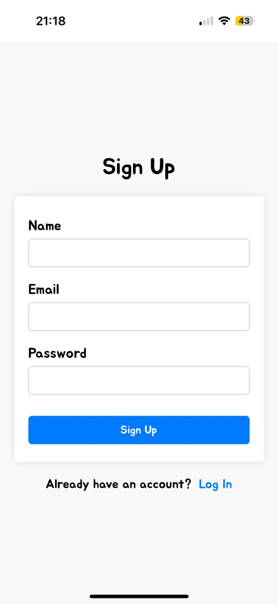
    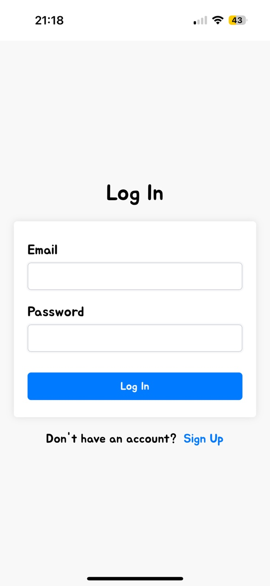

### 2. Home

On the **Home** page, you can view interactive graphs displaying your performance metrics, calories burned, calories consumed, and water intake. Built with Chart.js, these visualizations are both engaging and easy to understand, giving you valuable insights into your daily activities.

    

### 3. Exercise

The **Exercise** page allows you to log detailed information about your workouts, including activity category, specific exercise type, workout date, duration, and estimated calories burned. TrackMate features a built-in calories-burned calculator, making it easy to estimate energy expenditure based on the 2024 Adult Compendium of Physical Activities MET values (Compendium of Physical Activities). This scientifically grounded approach ensures that your calorie calculations are accurate and tailored to the intensity of your workouts.

    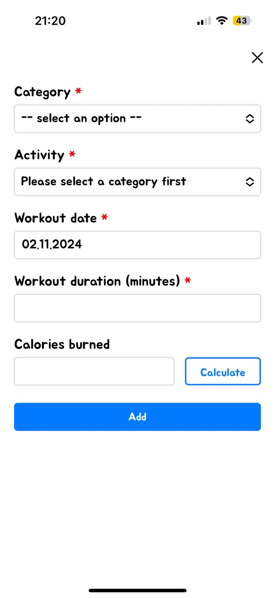
    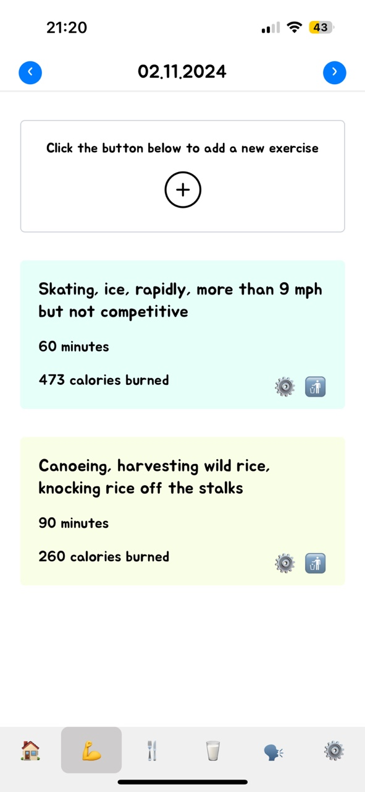

### 4. Food Intake

The **Food Intake** page lets you log your meals and track calories consumed throughout the day. With an intuitive interface and infinite scrolling, you can easily view your complete food intake history. Each entry is interactive, allowing you to click to edit or delete items as needed, so your records stay accurate and up-to-date.

    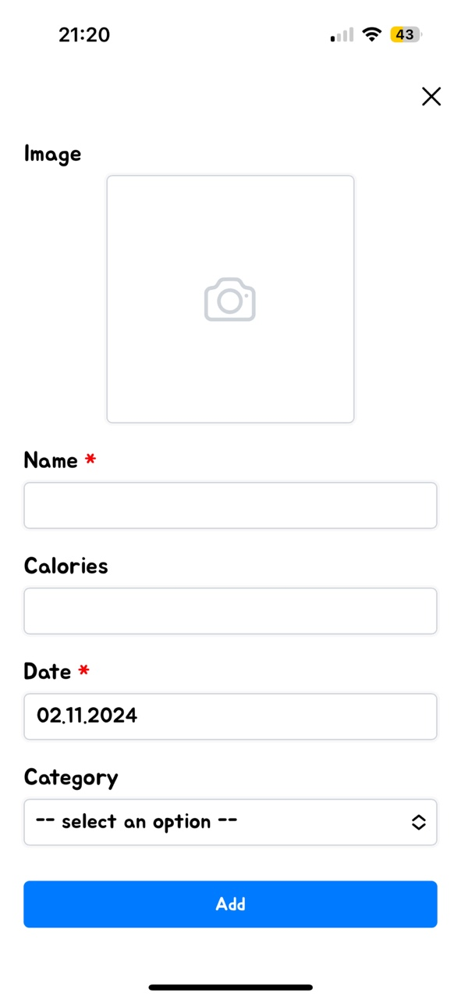
    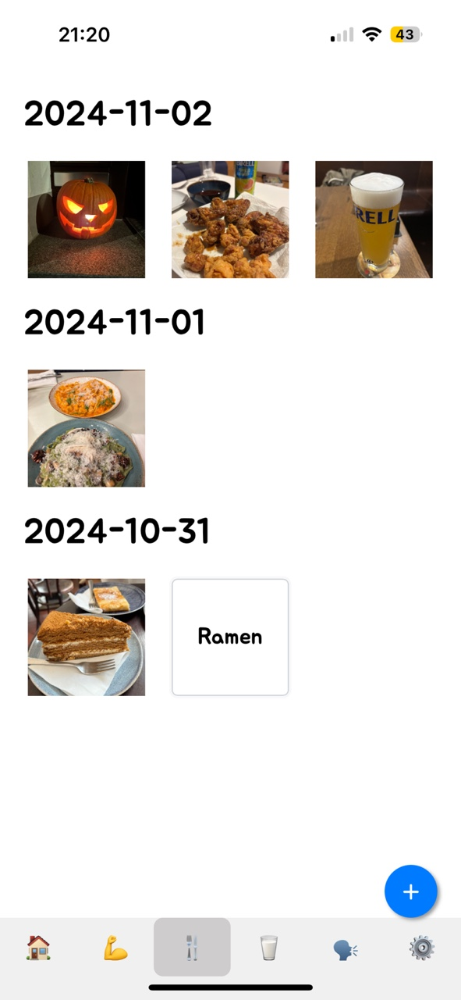
    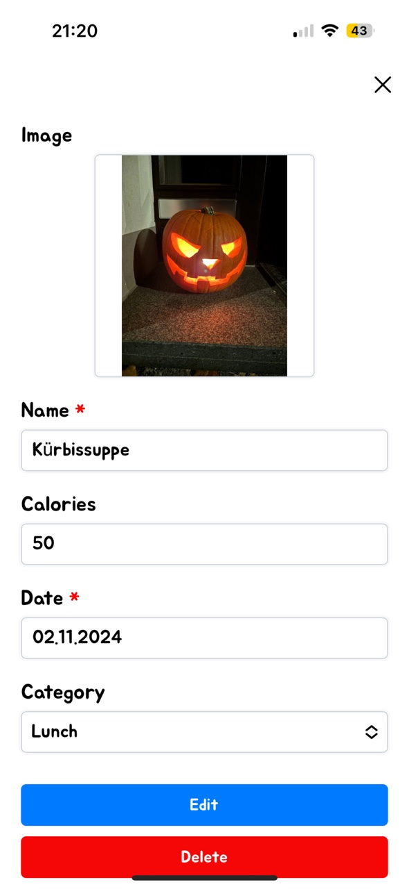

### 5. Water Intake

The **Water Intake** page encourages you to stay hydrated by motivating you to reach a daily goal of at least 2 liters of water. As you log your water intake, you’ll see a fun, interactive water wave animation in a glass, visually tracking your progress. Motivational messages also help keep you on track, making hydration goals engaging and achievable.

    

### 6. Community

The **Community** page allows you to connect with friends by creating groups and inviting others to join. Within your community, you can share updates on your progress, performance, and even your thoughts and feelings by writing posts and comments.

    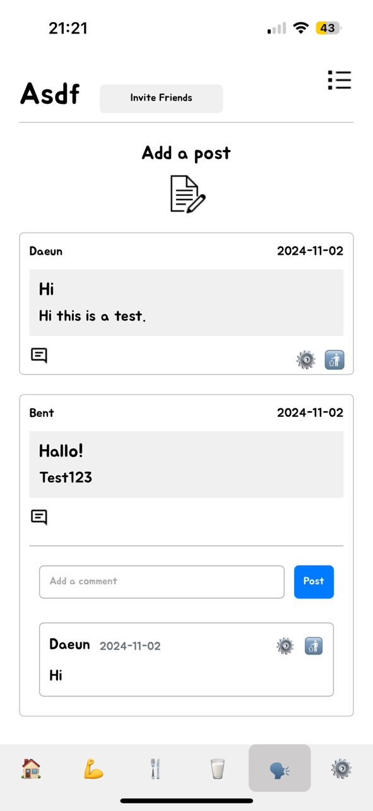
    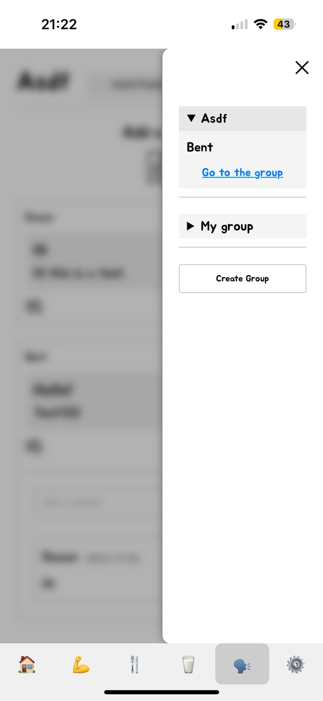
    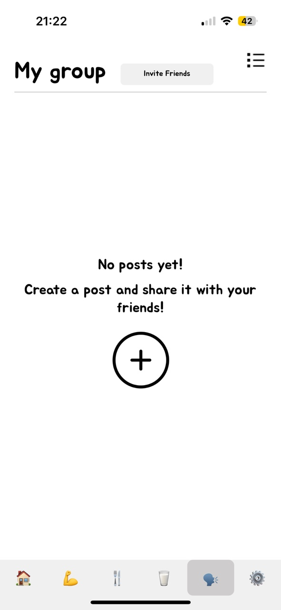

### 7. Settings

You have option to update your name, email, password, to log out or to delete your account on the **Settings** page

    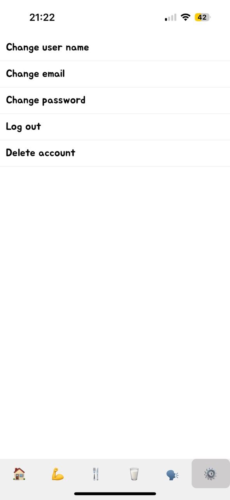

For logging out you have 2 options:

    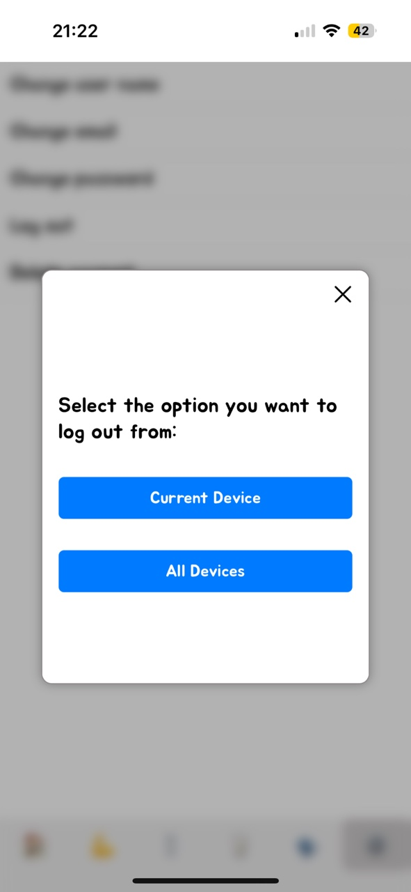

